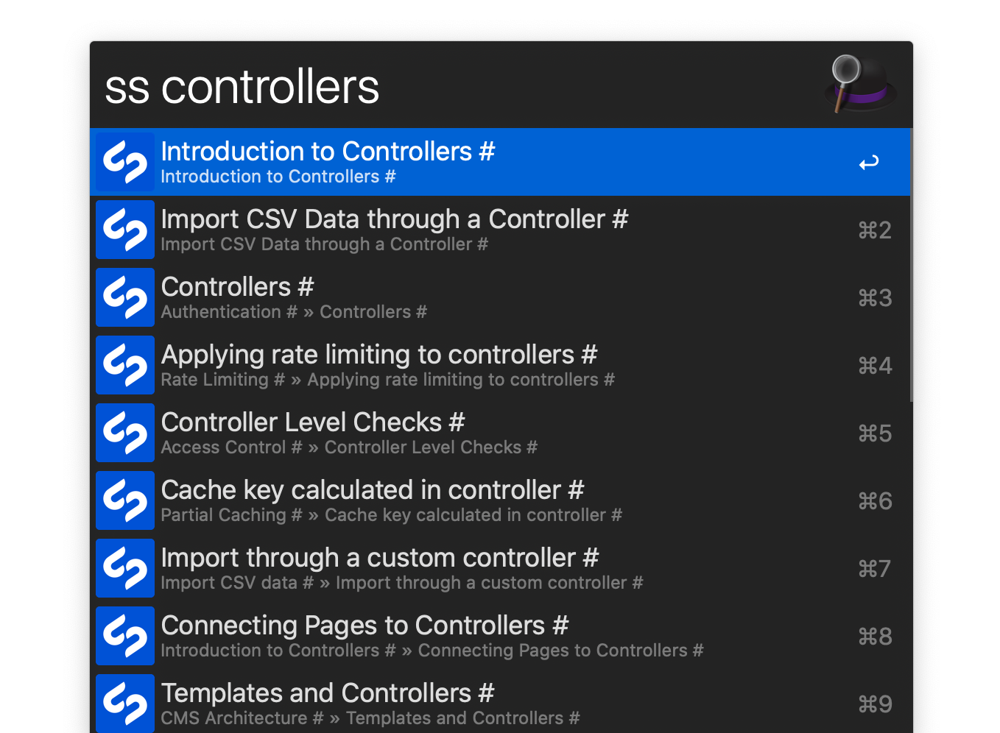

# Silverstripe Docs Workflow for Alfred

An ultra-fast Silverstripe docs search workflow for Alfred 3.

Adapted from [Alfred VueJS Docs](https://github.com/vmitchell85/alfred-vuejs-docs), which is adapted from [Alfred Laravel Docs](https://github.com/tillkruss/alfred-laravel-docs)



## Usage

Just type `ss` followed by your search query for [v4 docs](https://docs.silverstripe.org/en/4/)

```
ss <query>
```

To search the [v3 docs](https://docs.silverstripe.org/en/3/), just type `ss3` followed by your search query.

```
ss3 <query>
```


